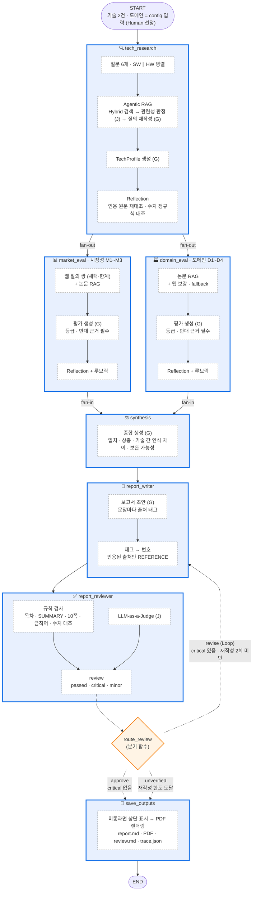

# Subject
본 프로젝트는 KV cache 최적화 기술을 소프트웨어(SW)·하드웨어(HW) 두 진영에서 1개씩 선정하여, **시장성 · 도메인 적용** 관점에서 평가하는 Multi-Agent + Agentic RAG 시스템을 개발하는 프로젝트임.
기술의 우열을 판정하지 않고, 같은 기술이 관점에 따라 어떻게 다르게 인식되는지를 비교·대조한 보고서를 자동 생성한다.

**범위 한정 (과제 지침 2가지)**
1. 기술 선정은 **(2안) Human 기반** — 에이전트 기반 선정(1안)은 구현하지 않고, Doc Pool 에서 진영별 1개를 직접 선택해 `app.py` 의 `TECHNOLOGIES` 상수로 입력
2. 평가 관점은 **2. 시장성 + 4. 도메인 적용만** — 1. 기술성숙도(TRL), 3. 이해관계자 관점과 이해관계자 평가 에이전트는 제외

## Overview
- Objective : 하나의 기술을 복수 관점(시장성·도메인 적용)에서 중립적으로 비교 평가하고 10쪽 이내 보고서 생성
- Method : Multi-Agent(LangGraph, fan-out/fan-in + 검토 Loop/Branch) + Agentic RAG(관련성 판정·질의 재작성·웹 fallback·Reflection)
- Tools : LangGraph, LangChain, FAISS, BM25(rank_bm25), Tavily Web Search, PyMuPDF, WeasyPrint

## Selected Technologies
| 진영 | 기술 | 논문 (RAG 문서) | 선정 사유 |
|---|---|---|---|
| SW · 아키텍처 개선 | **DeepSeek-V2 MLA** (Multi-head Latent Attention) | DeepSeek-V2 (arXiv 2405.04434, 52p) | 사후 압축이 아니라 어텐션 구조 자체를 바꿔 KV cache 93.3% 감소를 보고. 공개 모델·오픈소스 서빙 스택 채택 사례가 있어 시장성 근거가 풍부하고, 재학습이 필요한 구조 변경이라 도메인 도입 관점과 대비가 뚜렷함 |
| HW · 메모리 계층 확장 | **ITME** (CXL-Hybrid 계층 메모리 확장) | ITME (arXiv 2606.12556, 13p) | 원문 KV 를 그대로 두고 CXL-Hybrid 메모리로 TB 급 바이트 주소 공간을 확장. 배경의 'CXL 메모리 방식' 진영을 대표하고 데이터센터 공유 컨텍스트 인프라를 직접 겨냥. 2026년 메모리 기업 연구라 시장 근거가 간접적이라는 점 자체가 관점 간 차이를 드러냄 |

- **평가 도메인** : 데이터센터·클라우드 LLM 서빙 (1개로 고정, 도메인 기준 D1~D4 가 이 도메인을 가정)
- **RAG 문서 세트** : 선정 논문 2편 = **65페이지** (200페이지 한도 이내, `data/` 에는 선정 논문 2편만 포함)

## Features
- **PDF 기반 정보 추출** : 논문 원문을 페이지 단위로 로딩·청킹해 모든 근거에 `[P-SW p.N]` 페이지 인용을 붙임
- **Agentic RAG** : Hybrid 검색(BM25 + Dense, `tech` 필터) → Judge LLM 관련성 판정 → 0건이면 질의 재작성 후 재검색(최대 1회) → 그래도 없으면 "관련 근거 없음" 기록 또는 웹 fallback. 채택된 청크에는 앞 청크 문맥을 붙임(Parent Document). 모든 이력은 `outputs/trace.json` 에 남음
- **웹 검색 + 출처 레지스트리** : Tavily 결과의 URL·사이트명·게시일(비어 있으면 페이지 메타데이터에서 재추출)을 `sources` 에 등록 → 페이지 메타데이터(`citation_*`, `DC.*`)로 특허·논문·웹을 판별해 과제 REFERENCE 표기 형식(기울임 포함)으로 자동 조립, 잘린 제목은 페이지 제목으로 복원
- **인용 자동화** : 본문 태그(`[P-SW p.3]`, `[WM2]`)를 번호로 바꾸고, **실제 인용된 출처만** REFERENCE 로 출력
- **근거 검증(Reflection)** : 각 RAG 에이전트 끝에서 결과를 인용 페이지 원문과 다시 대조(Judge LLM) + 인용 문장 수치가 해당 페이지에 있는지 정규식 대조(결정론) → 문제가 있으면 1회 수정
- **보고서 검토 Loop** : 규칙 검사(목차·SUMMARY 길이·10쪽·금칙어·미등록 태그·수치-원문) + LLM-as-a-Judge → `revise / approve / unverified` 분기. 한도 도달 시에도 PDF 는 생성하고 미통과를 표시
- **확증 편향 방지 전략** (코드 `prompts/criteria.py: BIAS_STRATEGIES` = 보고서 6장과 동일)
  1. 질의 쌍 구성: 기준마다 웹 검색을 '채택·성과' 질의와 '한계·제약(사실)' 질의 쌍으로 수행, 반응·의견 질의(criticism/review/opinion) 미사용
  2. 반대 근거 강제: 모든 기준 평가에 `counter_evidence` 필수 필드
  3. 근거 출처 구분: 논문 수치는 "저자 보고 기준", 인접 기술·일반 시장 자료는 "간접 근거"로 표시
  4. 판단 유보 등급: 근거가 부족하면 등급을 만들지 않음
  5. 모델 분리: Generator 와 Judge 에 서로 다른 LLM 사용
  6. 이중 점검: 우열·추천 표현을 금칙어 규칙 + LLM Judge 로 이중 검사
  7. Reflection: 조사·평가 결과를 인용 페이지 원문과 재대조

## Tech Stack
| 구분 | 사용 |
|---|---|
| Framework | LangGraph 1.2, LangChain |
| LLM/Generator | `gpt-4.1` (temperature 0) — 조사·평가·종합·보고서 작성 |
| LLM/Judge | `gpt-5.4-mini` (reasoning low) — 관련성 판정·Reflection·보고서 검토 |
| Retrieval | FAISS + BM25 Hybrid (RRF, `tech` 필터) — Hit Rate@5 **0.567**, MRR@10 **0.507** (60문항, 아래 표) |
| Embedding | **BAAI/bge-m3** (오픈소스, 로컬 추론) |
| Web Search | Tavily |
| PDF | PyMuPDF(로딩), Markdown + WeasyPrint(보고서 렌더링) |

### Embedding 모델 선정 — `BAAI/bge-m3` 고정
오픈소스 후보 3종의 **특징을 이 과제 상황에 대조**해 선정하고, 파이프라인에 고정했다 (`rag/pipeline.py: EMBED_MODEL`). 리더보드 순위는 기준으로 쓰지 않았다.

**과제 상황 → 요구 사항**
| 상황 | 요구 |
|---|---|
| 원문이 영어 기술 논문 (수치·약어 다수) | 영어 기술 문서 검색 |
| 산출물·평가 기준이 한국어 ("도입 용이성", "품질 유지") | 한국어 표현도 온전히 다루는 한·영 다국어 |
| 교수자 PC 등 GPU 없는 환경에서 재현 | 로컬 추론 비용, 설정 단순성 |
| BM25 와 Hybrid 로 사용 | 정확한 수치·약어 매칭은 BM25 담당 → 임베딩은 의미 검색 역할 |
| 경제성 (과제 필수) | 오픈소스 · 무료 로컬 실행 · 상업 이용 가능 라이선스 |

**후보 특징** (모델 설정 파일·토크나이저로 확인)
| 항목 | **BAAI/bge-m3** ✅ | Qwen/Qwen3-Embedding-0.6B | BAAI/bge-small-en-v1.5 |
|---|---|---|---|
| 기반 · 규모 | XLM-RoBERTa · 약 5.7억 | Qwen3 LLM · 약 6억 | BERT · 약 0.3억 |
| 다운로드 · 차원 · 최대 길이 | 2.27GB · 1024 · 8,192 | 1.19GB · 1024 · 32,768 | 0.13GB · 384 · 512 |
| 언어 | 다국어 (한국어 포함) | 다국어 (한국어 포함) | 영어 전용 |
| 질의 지시문 | 불필요 | 필요 (`Instruct: …`) | 선택 |
| 한국어 "도입 용이성과 품질 유지 관점의 한계" | **9토큰, `도입`·`품질`·`유지`·`한계` 단어 단위** | 17토큰, 바이트 단위 분해 | 34토큰, 자모 분해 + `[UNK]` |
| 수치 "93.3% … 5.76×" | `93` `3%` `5.` `76` 덩어리 유지 | `9` `3` `.` `3` 한 자리씩 분해 | `93` `.` `3` |
| 로컬 인덱싱 (240청크) | 46초 | 104초 | 29초 |
| 라이선스 | MIT | Apache-2.0 | MIT |

**선정 근거**
1. 한국어·영어를 모두 단어 단위로 다뤄, 한국어 평가 기준 용어와 영어 원문을 함께 다루는 이 과제에 맞음
2. bge-small 은 가장 가볍지만 영어 전용이라 한국어가 자모로 분해되고 `[UNK]` 가 생겨 제외
3. Qwen3 는 한국어를 지원하지만 질의마다 지시문이 필요해 설정이 늘고, 로컬 인덱싱이 2.3배 느림
4. MIT 라이선스, 로컬 무료 실행으로 경제성 요건 충족
- 감수하는 점: 다운로드 2.27GB 로 후보 중 가장 큼 (최초 1회, 이후 캐시)

**검색 품질** (`python -m rag.evaluate`, 고정 모델 bge-m3 기준)
평가셋: 논문 청크 60개에서 LLM 이 분석가식 질문을 생성한 (질문, 정답 청크) 쌍 (`outputs/retrieval_eval_set.json`, 저장본 재사용 시 LLM 호출 없음).

| 검색 방식 (60문항) | Hit@1 | Hit@3 | Hit@5 | MRR@10 |
|---|---|---|---|---|
| Dense (bge-m3) | 0.317 | 0.483 | 0.517 | 0.403 |
| BM25 | 0.450 | 0.567 | 0.617 | 0.532 |
| **Hybrid (RRF, 사용 중)** | 0.433 | 0.550 | 0.567 | 0.507 |

> 해석: 질문이 청크 문장에서 생성돼 어휘 겹침이 많아 BM25 에 유리한 편향이 있고, 정답을 청크 1개로만 인정해 관련 문단을 찾아도 오답이 되는 경우가 있음. 실제 에이전트 질의(추상적 질문·재작성 질의)는 Dense 의 의미 검색이 보완하도록 Hybrid 를 유지했고, 검색 뒤 관련성 판정·질의 재작성 루프가 누락을 한 번 더 보완한다.

## Agents
관점 2개에 맞춘 **최소 6 에이전트 + 저장 노드 1개**. RAG loader·chunking·embedding·retriever·web search·citation·export 는 에이전트가 아닌 일반 컴포넌트(`rag/pipeline.py`, `agents/report.py` 헬퍼).

| 에이전트 (노드) | 입력(State) | 출력(State key) | 도구 | 판단 책임 |
|---|---|---|---|---|
| 🔍 기술 조사 `tech_research` | `technologies` | `tech_profiles`, `sources`(논문), `trace` | Agentic RAG + Reflection | 논문 원문만 근거로 개요·핵심 방식·저자 보고 성과·실험 조건·한계·도입 조건 추출 |
| 📊 시장성 평가 `market_eval` | `technologies`, `tech_profiles` | `market_eval`(M1~M3 × 2기술), `sources`(WM*), `trace` | Agentic RAG + **웹 검색** + Reflection | 시장 규모·채택·생태계 등급. 웹이 주근거, 논문은 구현·통합 수준 확인 |
| 🏭 도메인 평가 `domain_eval` | `technologies`, `tech_profiles`, `domain` | `domain_eval`(D1~D4 × 2기술), `sources`(WD*), `trace` | Agentic RAG + 웹 보강 + Reflection | 데이터센터·클라우드 서빙 적합성 등급. 논문 실험이 주근거 |
| ⚖️ 평가 종합 `synthesis` | `tech_profiles`, `market_eval`, `domain_eval` | `synthesis` | 없음 | 일치 / 상충 / 기술 간 인식 차이 / 보완 가능성 / 유의점 (새 사실 생성 금지) |
| 📝 보고서 생성 `report_writer` | 위 전부 + `sources` + `review`(재작성 시) | `report_md`, `revision_count` | 없음 | 목차 구성·서술, 태그 → 번호·REFERENCE 자동 변환 |
| ✅ 보고서 검토 `report_reviewer` | `report_md`, `sources` | `review` | 규칙 검사기 + Judge LLM | critical 있으면 revise, 없으면 approve, 한도 도달 시 unverified |
| 💾 저장 `save_outputs` (에이전트 아님) | `report_md`, `review` | `outputs` | MD/PDF export | 단순 I/O |

- 기술 2건(SW ∥ HW)은 각 에이전트 **노드 내부에서 병렬** 처리하고 `{"sw": ..., "hw": ...}` 로 한 키에 담음 (노드 수를 늘리지 않음)
- 시장성·도메인 평가는 같은 절차 함수(`evaluate_perspective`)를 공유하지만 기준·근거원·판단 책임이 다른 독립 에이전트

## Architecture
**읽는 법** — 굵은 테두리 상자 = LangGraph **node** (`add_node`) · 실선 = **edge** (`add_edge`) · 점선 = **conditional edge** (`add_conditional_edges` + 분기 함수 `route_review`) · 상자 안 점선 테두리 단계 = 노드 함수 **내부 처리** (그래프 노드 아님) · `(G)` Generator LLM, `(J)` Judge LLM


- Workflow: 정보 수집(기술 조사) → 평가(시장 ∥ 도메인, **fan-out**) → 종합(**fan-in**) → 보고서
- Loop: `report_writer ⇄ report_reviewer`, `MAX_REPORT_REVISION = 2`
- Branch: `route_review` 의 `revise / approve / unverified` 3갈래 조건부 엣지
- 종료 보장: 그래프 `recursion_limit = 25`, Agentic RAG `MAX_QUERY_REWRITE = 1`
- 코드와의 일치 증빙: 실행 시 `app.get_graph().draw_mermaid()` 결과를 `outputs/graph.mmd` 로 저장

### State
| Key | Type | Reducer | 작성 노드 | 설명 |
|---|---|---|---|---|
| `technologies` | dict | 덮어쓰기 | 입력 | 선정 기술 2건 `{"sw", "hw"}` (이름, 진영, 논문·파일, 선정 사유, 출처 ID `P-SW`/`P-HW`, citation, 웹 검색어 `search`·`market`·`ecosystem`) |
| `domain` | dict | 덮어쓰기 | 입력 | 평가 도메인 (이름, 설명) |
| `tech_profiles` | dict | 덮어쓰기 | tech_research | 기술별 TechProfile |
| `market_eval` | dict | 덮어쓰기 | market_eval | 기술별 PerspectiveEvaluation (M1~M3) |
| `domain_eval` | dict | 덮어쓰기 | domain_eval | 기술별 PerspectiveEvaluation (D1~D4) |
| `synthesis` | dict | 덮어쓰기 | synthesis | Synthesis (일치·상충·인식 차이·보완·유의점) |
| `report_md` | str | 덮어쓰기 | report_writer | 인용 번호·REFERENCE 반영된 마크다운 |
| `revision_count` | int | 덮어쓰기 | report_writer | 재작성 횟수 (Loop 종료 조건) |
| `review` | dict | 덮어쓰기 | report_reviewer | `{passed, critical[], minor[], pages}` |
| `sources` | list[dict] | `operator.add` | 조사·시장·도메인 | 출처 레지스트리 `{id, kind, tech, title, url, site, date, citation}` — 웹 ID 는 노드별 prefix `WM*`/`WD*` |
| `trace` | list[dict] | `operator.add` | 조사·시장·도메인 | 검색·관련성 판정·재작성·웹 질의·Reflection 이력 |
| `outputs` | dict | 덮어쓰기 | save_outputs | 산출물 경로 `{md, pdf, review, trace, pages, review_passed}` |

### 평가 기준 (코드 `prompts/criteria.py` 와 1:1)
등급 = 해당 관점에서 유리하게 인식되는 정도(기술 간 우열 아님): `높음 / 중간 / 낮음 / 판단 유보` + 근거의 양·독립성에 따른 `신뢰도`.

| 관점 | ID | 기준 | 평가 대상 | 높음 | 중간 | 낮음 | 주근거 |
|---|---|---|---|---|---|---|---|
| 시장성 | M1 | 시장 규모·성장성 | 기술이 속한 시장의 규모·전망 | 시장 리포트·업계 발표로 성장세 확인 | 인접 시장 수치 등 간접 근거만 | 수요 불확실·축소 신호 | 웹 |
| 시장성 | M2 | 상용화·채택 현황 | 제품 출시, 서비스 도입, 오픈소스 통합 | 상용 제품·주요 서빙 스택 탑재 | 시제품·PoC·실험적 통합 | 논문·연구 단계 | 웹 + 논문 |
| 시장성 | M3 | 생태계 지지 | 지원 프레임워크, 표준화 동향 | 복수 프레임워크 지원 또는 산업 표준 기반 | 일부 커뮤니티 구현·표준 논의 | 독자 구현만 존재 | 웹 + 논문 |
| 도메인 | D1 | 비용 효율 | GPU·메모리 비용 절감 여지 | 추가 비용 없이 수용량 확대가 수치로 확인 | 절감 효과 있으나 추가 투자·조건 필요 | 비용 증가 요인이 더 큼 | 논문 |
| 도메인 | D2 | 처리량·지연 | 동시 요청 환경의 throughput·latency·SLO | 서빙 조건에서 처리량 향상 + 지연 유지 | 특정 조건에서만 개선 | 지연·오버헤드 증가 | 논문 |
| 도메인 | D3 | 품질 유지 | 정확도·출력 품질 손실 위험 | 정확도 벤치마크로 손실 없음/무시 가능 | 조건부 손실 | 유의미한 손실 | 논문 |
| 도메인 | D4 | 도입 용이성 | 기존 서빙 스택 호환, 추가 HW, 운영 복잡도 | SW 변경만으로 도입 | 일부 커널·시스템 수정 또는 제한적 HW 추가 | 신규 인프라·장비 필요 | 논문 + 웹 |

- 근거 부족 시 `판단 유보`. D3 는 정확도 지표만 인정(처리량·지연 수치를 품질 근거로 쓰지 않음)
- 구조화 출력: `CriterionAssessment{criterion_id, rating, confidence, rationale, supporting_evidence[], counter_evidence[]}`, `PerspectiveEvaluation{assessments[], overall_view, information_gaps[]}`, `Synthesis{agreements[], conflicts[ConflictPoint], tech_contrast[], complementarity, caveats[]}`

### 보고서 구조 · 검토 규칙
SUMMARY(½쪽 이내) → 1. 분석 배경 → 2. 기술 선정(Human 기반 직접 선정 명시) → 3. 기술 개요 → 4. 관점별 평가(4.1 시장성 / 4.2 도메인 적용) → 5. 시사점(관점 간 상충 표) → 6. 한계점(확증편향 방지 7항목) → REFERENCE(인용된 자료만). 총 10쪽 이내.

| 구분 | 검사 항목 | 실패 시 |
|---|---|---|
| 규칙 | 필수 목차, 첫 장 SUMMARY / 마지막 장 REFERENCE | critical |
| 규칙 | SUMMARY ≤ 900자, PDF ≤ 10쪽 | critical |
| 규칙 | 우열·추천 금칙어 | critical |
| 규칙 | 미등록·형식 오류 출처 태그, 논문 인용 문장 수치의 원문 존재 여부 | critical |
| Judge | 상충 지점 명시, 수치 출처, "저자 보고 기준" 구분, SUMMARY 가 결과 요약인지, 출처-주장 일치, 제외 관점(이해관계자·TRL) 혼입 | critical / minor |

## Results (저장소 `outputs/` 기준, `python app.py` 1회 실행, 약 2분 40초)
- 보고서: `outputs/RAG-Output_판교_9반_한상준.pdf` **6쪽** (SUMMARY → 1~6장 → REFERENCE), 검토 **approve** — 첫 작성본에서 critical 1건 → `revise` 로 1회 재작성 → 통과 (`outputs/review.md`: 재작성 횟수 1)
- Agentic RAG: 논문 질의 24건 중 **2건이 관련 근거 0 → 질의 재작성 후 재검색으로 근거 확보** (예: "What limitations … of DeepSeek-V2 MLA" → "DeepSeek-V2 MLA limitations, overhead, trade-offs …"), 웹 질의 16건(채택·한계 쌍). 이력은 `trace.json` 의 `attempts`
- 출처: 레지스트리 42건 중 **본문에 실제 인용된 23건만** REFERENCE 로 출력 (논문 3 · 기타 20, 인용이 없는 특허 소제목은 생략)
- Reflection: 6회(3 에이전트 × 2 기술)에서 17건 지적 → 수정 (예: 처리량 개선 35.7% 를 비용 절감 근거로 쓴 지표 혼동(D1), MLA 적용 전후 통제 비교 없이 "품질 손실 없음" 단정(D3), 원문 Figure 10 과 다른 ITME 성능 서술)
- 검토 Loop 동작 이력: 위 1회 재작성 외에, 초기 버전에서는 critical 이 남아 `revise → revise → unverified` 로 종료되고 이때도 PDF 상단에 미통과 표시와 함께 생성됨을 확인
- `outputs/graph.mmd` 는 코드에서 추출한 그래프. `approve` 와 `unverified` 가 같은 `save_outputs` 로 가서 그림에서는 한 선으로 합쳐 표시됨 (코드는 3갈래 매핑)
- LLM·웹 검색 결과는 실행마다 달라질 수 있어 쪽수·출처 수·등급은 변동될 수 있으나, 그래프 구조·규칙 검사·REFERENCE 생성 방식은 동일하게 재현됨

## Directory Structure
```
├── data/                   # Doc Pool PDF (RAG 문서 세트: 2405.04434, 2606.12556 = 65p)
├── agents/
│   ├── research.py         # 🔍 기술 조사 · 📊 시장성 · 🏭 도메인 평가 (RAG 에이전트 + Reflection)
│   └── report.py           # ⚖️ 종합 · 📝 보고서 생성 · ✅ 검토 · 💾 저장, 인용→REFERENCE, PDF 렌더링
├── prompts/
│   ├── criteria.py         # 평가 기준 M1~M3·D1~D4, 확증편향 방지 전략, 보고서 규칙
│   └── templates.py        # LLM 프롬프트
├── rag/
│   ├── pipeline.py         # 로딩·청킹·임베딩·FAISS/BM25 Hybrid·Agentic 검색 루프·웹 검색·수치 대조
│   └── evaluate.py         # 검색 품질 측정 (Hit Rate@K / MRR, Dense·BM25·Hybrid)
├── tests/test_offline.py   # LLM 없이 도는 결정론 검사 (인용 변환·수치 대조·검토 규칙·분기)
├── outputs/                # 보고서 PDF/MD, review.md, trace.json, graph.mmd, retrieval_eval*.json
├── app.py                  # 입력 config · State · Graph · 실행
└── README.md
```

## Usage
```bash
python3.11 -m venv .venv && source .venv/bin/activate
pip install -r requirements.txt          # WeasyPrint 는 pango 필요 (macOS: brew install pango)
cp .env.example .env                     # OPENAI_API_KEY, TAVILY_API_KEY 입력
python app.py                            # → outputs/RAG-Output_*.pdf, report.md, review.md, trace.json, graph.mmd
python -m rag.evaluate                   # (선택) 검색 품질 재측정 (LLM 호출 없음)
python tests/test_offline.py             # (선택) 결정론 검사
```
첫 실행 시 bge-m3 를 내려받고 인덱스를 `.cache/` 에 저장한다(이후 재임베딩 없음).

OS별 준비 (PDF 렌더러 WeasyPrint·한글 폰트)
- macOS: `brew install pango` (한글 폰트 기본 내장)
- Ubuntu/Debian: `sudo apt install libpango-1.0-0 libpangoft2-1.0-0 fonts-noto-cjk`
- Windows: [GTK3 runtime](https://github.com/tschoonj/GTK-for-Windows-Runtime-Environment-Installer/releases) 설치, 가상환경 활성화는 `.venv\Scripts\activate`, `.env` 복사는 `copy .env.example .env`

## Contributors
- 한상준 : 과제 설계, Agent 설계·구현(LangGraph), RAG 파이프라인·임베딩 평가, 프롬프트 엔지니어링, 보고서 검증 로직
