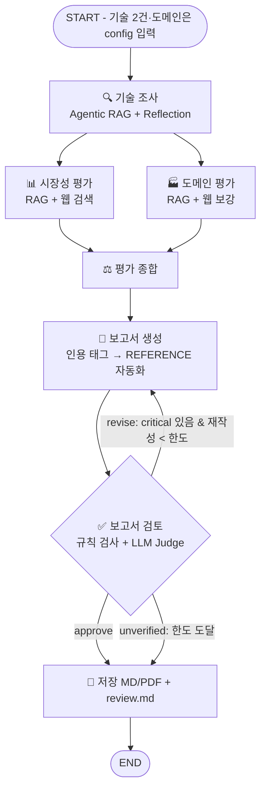

# KV cache 최적화 기술 평가 — 가이드라인 (범위 한정본)

> 원본: Notion "KV cache 최적화 기술 평가" (SK AX / SKALA, Keejoo Bae)
> 원문 전체는 `docs/00-notion-original.md` 참조.
> 본 문서는 원본에 **실습 범위 한정 지침(§0의 2가지)**과 **실습 과제 제출 지침(§0 제출)**을 적용하여 재정리한 것.
> 두 지침이 언급하지 않은 항목(보고서 형식, 채점 항목 등)은 **원본 그대로** 따른다.

---

## 0. 한눈에 보는 범위 한정 요약

실습 범위 한정 지침은 아래 **2가지뿐**이다.

| 지침 위치 | 원본 | **범위 한정 적용** |
|---|---|---|
| GUIDE > B. 설계 > 기술 선정 | (1안) 에이전트 기반 / (2안) Human 기반 중 선택 | **(1안)으로 진행하지 않음.** (2안) Human 기반으로, **Doc Pool에서 진영별 1개씩 직접 선택** |
| GUIDE > C. 평가 관점 및 기준 | 1.기술성숙도(TRL) / 2.시장성 / 3.이해관계자 / 4.도메인적용 (+5.종합) | **2. 시장성 관점 + 4. 도메인 적용 관점만** (1, 3번 제외) |

**실습 과제 제출 지침**

| 항목 | 원본 | **적용** |
|---|---|---|
| 제출물 | 설계 산출물 + 개발 산출물 + 발표 | **개발 산출물만** (설계 산출물 미대상) |
| 제출 방법 | 반별 채널 slack thread | **thread로 Git link(public) + PDF** |
| 마감 | 설계 DAY 3 10시 / 개발 DAY 3 15시 | **2026-09-27(일) 자정까지** |
| 채점 | 설계 100점 + 개발 100점 | **개발 산출물 100점만** (§10) |

> 설계 산출물 PDF는 내지 않지만, 개발 채점의 "설계 구현 충실도 15점"은 설계 내용이 코드에 반영됐는지를 본다.
> 따라서 State 표, Graph mermaid, 에이전트 표, 평가 기준 표는 **README에 설계 문서 역할로** 넣는다.
> 발표는 제출 지침에 언급이 없다. 필요 여부는 별도 공지로 확인한다 (§9-3).

---

## 1. 실습 목표 & 주제

**목표**
- LangGraph 기반 Multi-Agent + Agentic RAG 설계 및 개발
- 하나의 기술을 복수 관점에서 **중립적으로** 비교 평가하고 최종 보고서 생성

**주제**
> KV cache 최적화 기술 다관점 평가 — **SW 압축 vs HW 메모리 접근**

- KV cache라는 하나의 병목을 상반된 접근으로 푸는 **두 진영**의 기술을 각각 조사
- (범위 한정) **시장성 / 도메인 적용** 관점에서 어떻게 평가받고 있는지 비교 분석
- 다관점 평가 보고서를 작성하는 Multi-Agent (+Agentic RAG) 설계 및 구현

**핵심 원칙 (반드시 지킬 것)**
- 기술 평가는 **"우열" 판정이 아님**. 하나의 기술이 관점에 따라 어떻게 **다르게 인식되는가**를 조사·비교·대조하는 것
- "시장은 A를 이렇게 보고, 도메인 전문가는 이런 한계를 지적한다" 라는 시각 유지
- 특정 기술을 추천하거나 순위를 매기지 않음

---

## 2. 배경 지식 — 왜 KV cache가 문제인가

- LLM은 토큰을 하나씩 생성하며 앞서 계산한 Key-Value를 저장·재사용함 ⇒ KV cache
- 재계산 낭비는 없애주지만, 문맥이 수천~수백만 토큰으로 길어지면 저장량이 **선형으로 증가** → 가속기의 **HBM 용량을 빠르게 소진**
- 즉 KV cache는 **"연산 병목"을 "메모리 병목"으로 바꿔 놓은 셈**
- 두 가지 접근:
  - **SW 관점**: 데이터를 작게 만들자
  - **HW 관점**: 담을 공간을 넓히자
- 대립적으로 보이나 실제로는 **함께 쓰이는 경우가 많음** (데이터를 작게 만들면 넓은 공간으로 옮기기 쉬워짐) — 보고서에서 이 점을 짚어주면 좋음

### 진영 1 — SW : 데이터를 작게 만들자
KV cache 자체 크기를 줄이는 것
- 기존 HW(GPU/HBM) 위에서 **SW만으로 즉시 적용 가능**
- 다만 압축률을 높이면 **정확도 하락 위험**
- 아키텍처 변형(MLA)은 강력하지만 최적화된 서빙을 위한 **시스템 복잡도** 고려 필요

1. **압축/양자화** — 이미 만들어진 cache를 사후에 줄이기
   - Google, TurboQuant : 더 적은 비트로 저장, 어텐션 처리 속도 최대 8배 보고
   - NVIDIA, KVTC : 이미지/영상 압축 유사 변환 부호화, 최대 20배 압축하며 정확도 유지 보고
2. **아키텍처 개선** — 애초에 작게 나오도록 구조 변경
   - DeepSeek, MLA (Multi-head Latent Attention) : KV를 저차원 잠재 공간으로 압축, KV cache 93.3% 감소하며 표준 어텐션보다 나은 성능 보고

### 진영 2 — HW : 담을 공간을 넓히자
원본은 그대로 두고 **"어디에 담느냐"**를 바꿈
- KV cache를 비싼 HBM 밖으로 옮겨 더 넓고 값싼 메모리/스토리지 계층에 배치
- **정확도 손실 없이 대용량 확장** 가능하나, **새 인프라 필요 + 전송 지연** 이슈 잔존
- 딜레마: GPU에 유지하면 타 사용자 메모리를 잠식 / 버리면 재계산 비용 / 외부 이전은 전송 오버헤드 → **'옮기기'를 빠르게 만드는 데 집중**
- NVIDIA, CMX : KV cache를 NVMe 스토리지로 확장. 4계층 메모리 위계를 두어 NVMe 상주 KV cache를 컨텍스트 메모리 주소 공간의 일부로 만듦
- CXL 메모리 방식 : NVMe 플래시 대신 CXL 메모리로 처리하는 제품 개발 중

---

## 3. Doc Pool — 여기서 **각 진영 1개씩** 직접 선택 (범위 한정 조건)

### 진영 1 · SW (압축/양자화, 어텐션 아키텍처 개선) — 1개 선택
| # | 기술 | 논문 | 특징 | 링크 |
|---|---|---|---|---|
| 1 | **TurboQuant** | TurboQuant: Online Vector Quantization with Near-optimal Distortion Rate (2025-04) | KV cache를 3비트로 양자화 | https://arxiv.org/pdf/2504.19874 |
| 2 | **DeepSeek-V2 (MLA)** | DeepSeek-V2: A Strong, Economical, and Efficient Mixture-of-Experts Language Model (2024-06) | 저차원 잠재 압축으로 93.3% 감소 | https://arxiv.org/pdf/2405.04434 |
| 3 | **KIVI** | KIVI: A Tuning-Free Asymmetric 2bit Quantization for KV Cache (2024-06-25) | 양자화 계열 대표 베이스라인 | https://arxiv.org/pdf/2402.02750 |

### 진영 2 · HW (메모리/스토리지 계층 확장) — 1개 선택
| # | 기술 | 논문 | 특징 | 링크 |
|---|---|---|---|---|
| 1 | **InfiniGen** (Dynamic KV Cache Mgmt) | InfiniGen: Efficient Generative Inference of LLMs with Dynamic KV Cache Management (2024-06) | 필수 KV 항목만 프리패치하여 호스트 메모리 오프로딩 개선, 최대 3배 | https://arxiv.org/pdf/2406.19707 |
| 2 | **ITME** (CXL-based) | ITME: Inference Tiered Memory Expansion with Disaggregated CXL-Hybrid Memories (2026-06) | CXL-Hybrid 계층적 메모리 확장, 대규모 LLM 추론 1.80배 처리량 향상 | https://arxiv.org/pdf/2606.12556 |
| 3 | **PIM/CXL** | Scalable Processing-Near-Memory for 1M-Token LLM Inference: CXL-Enabled KV-Cache Management Beyond GPU Limits (2025-10) | DIMM 기반 PIM으로 용량·대역폭 동시 확장 | https://arxiv.org/pdf/2511.00321 |

> **선택 시 기록할 것**: 선정 기술 2건 + **선정 사유**. README와 보고서 "기술 선정" 챕터에 반드시 명시.

---

## 4. GUIDE A. Agent 정의 (범위 한정 적용안)

원본 제안 에이전트 6종 중, **이해관계자 평가 에이전트는 제외**(3번 관점 미대상). 기술 성숙도(TRL)는 별도 에이전트가 없었으므로 영향 없음.

| 에이전트 | 역할 | RAG 여부 | 내용 | 적용 |
|---|---|---|---|---|
| 🔍 기술 조사 에이전트 | 기술 2건의 원문 확보·핵심 추출 | **O** | 원문에서 기술 개요, 범위, 한계 추출 | **유지** |
| 📊 시장 평가 에이전트 | 시장성, 채택 현황 조사 | **O** | 시장 규모, 상용화/채택 사례, 성장 전망 검색 | **유지 (관점 2)** |
| 🤝 이해관계자 평가 에이전트 | 관계자별 반응 조사 | X | 경쟁사 반응, 개발자 평가, 투자/업계 시각 | **제외** |
| 🏭 도메인 평가 에이전트 | 적용 도메인별 적합성 | **O** | 데이터센터, 온디바이스, 클라우드 서빙 등에서의 평가 | **유지 (관점 4)** |
| ⚖️ 평가 종합 에이전트 | 관점별 의견 종합 및 비교 | X | 관점 간 일치/불일치 기반 종합 | **유지** (시장·도메인 2개 관점 종합) |
| 📝 보고서 생성 에이전트 | 평가 보고서 생성 | X | 단계별 내용을 연결하여 보고서 생성 | **유지** |
| ✅ 보고서 검토 에이전트 | 보고서 규칙 검사 + LLM-as-a-Judge | X | 목차·분량·우열 표현·인용 근거 검사 → 재작성/승인 분기 | **추가** (Loop·Branch 담당, §7) |

> 설계 목적에 따라 추가/변경 가능. 단 채점 기준상 **"불필요한 에이전트 없이 명확한 책임"**이 중요하므로, 관점 2개에 맞는 최소 구성을 유지할 것.
> 검토 에이전트는 채점표의 "Loop, Branch 구조"와 "흐름 제어" 항목을 채우는 유일한 노드이므로 추가함. 저장(MD/PDF export)은 에이전트가 아니라 그래프 마지막의 단순 노드로 둠.

### 4-1. 에이전트별 입력·출력·도구 (책임 경계)

| 에이전트 | 입력(State) | 출력(State key) | 도구 | 비고 |
|---|---|---|---|---|
| 🔍 기술 조사 | `technologies` | `tech_profiles` (기술별: 개요·핵심 방식·저자 보고 성과·실험 조건·한계·도입 조건) | Agentic RAG (§5-2) | 논문 원문만 근거. baseline/관련 연구 서술이 대상 기술로 섞이지 않게 검증 단계 포함 |
| 📊 시장 평가 | `technologies`, `tech_profiles` | `market_eval` (기준 M1~M3 × 기술 2건) | Agentic RAG + **웹 검색** | 시장 규모·채택 사례는 논문에 없음 → 웹 검색이 주근거, 논문은 구현·통합 수준 확인용. 웹 결과는 출처 레지스트리(`sources`)에 등록 |
| 🏭 도메인 평가 | `technologies`, `tech_profiles`, `domain` | `domain_eval` (기준 D1~D4 × 기술 2건) | Agentic RAG + 웹 검색(보강) | 논문 실험 결과가 주근거, 웹은 실서빙 반응 보강 |
| ⚖️ 평가 종합 | `tech_profiles`, `market_eval`, `domain_eval` | `synthesis` (일치 / 상충 / 기술 간 인식 차이 / 보완 가능성 / 유의점) | 없음 | 새 사실 생성 금지, 입력의 출처 태그 유지 |
| 📝 보고서 생성 | 위 전부 + `sources` + `review`(재작성 시) | `report_md`, `revision_count` | 없음 | 본문에 출처 태그 인용 → 실제 인용된 것만 REFERENCE로 자동 변환 |
| ✅ 보고서 검토 | `report_md`, `sources` | `review` (passed, critical, minor, pages) | 규칙 검사기 + Judge LLM | 규칙 위반과 Judge critical 이 있으면 `revise`, 없으면 `approve`, 한도 도달 시 `unverified` |

**SW/HW 두 기술의 처리 방식 (결정)**
- 기술 조사·시장·도메인 에이전트는 **기술 2건을 각각 독립적으로 처리**하고 결과를 `{"sw": ..., "hw": ...}` 형태로 한 키에 담음
- 병렬화는 두 단계: (a) 관점 간 fan-out은 **그래프 노드 단위**(시장 ∥ 도메인), (b) 기술 간(SW ∥ HW)은 **노드 내부 병렬**(스레드 또는 LangGraph `Send`). 그래프에 노드가 6개 → 12개로 불어나 "불필요한 에이전트" 지적을 받지 않도록 (b)는 노드 내부로 숨김
- 두 기술의 근거가 섞이지 않도록 검색 시 `tech` 메타데이터 필터를 필수로 적용

**LLM 역할 분리 (결정)**
- Generator(조사·평가·종합·보고서) 와 Judge(관련성 판정·보고서 검토)를 **서로 다른 모델**로 둠 — 강의 메모 §6 "자기 모델 평가 문제" 대응. README Tech Stack 의 `LLM/Generator`, `LLM/Judge` 항목에 각각 기재

---

## 5. GUIDE B. 설계

### 5-1. 기술 선정 — **(2안) Human 기반 확정**
- SW, HW 각 진영에서 하나씩, 총 **2개 기술 선정**
- **(1안) 에이전트 기반 선정은 구현하지 않음.** 선정은 §3 Doc Pool에서 사람이 직접.
- 그래프의 시작 노드는 "기술 선정"이 아니라 **선정된 2건을 입력으로 받는 형태**(설정/상수/config)로 구성

### 5-2. RAG 적용
- "RAG 여부 = O"인 에이전트(기술 조사 / 시장 평가 / 도메인 평가) 중 **최소 1개는 RAG 기반으로 설계·개발**
- 문서 구성은 자유. 단 **문서 개수와 무관하게 총 200페이지 한정**
  - Doc Pool에서 선정한 기술의 논문 2편(SW 1 + HW 1)이 기본. 200p 예산 안에서 보조 자료 추가 가능
  - 용어 구분: **Doc Pool** = 기술 선정 후보 목록(§3, 선정은 진영별 1개로 고정). **RAG 문서 세트** = 임베딩해서 검색하는 PDF 묶음(원본 B절에 따라 자유 구성). 보조 자료를 추가해도 선정 기술 수는 바뀌지 않음
- 문서 로딩 → 임베딩 → 검색 → 컨텍스트 활용 흐름이 **정상 동작**해야 함 (채점 20점)

#### 5-2-1. "Agentic" RAG 루프 정의 (어디서·무엇을 반복하는가)
단순 검색과 구분되는 부분. **RAG 에이전트 3개 내부에서 질문 단위로** 아래 루프를 돌림 (그래프 노드로 노출하지 않음).

```
질문 → Hybrid 검색(BM25 + Dense, tech 필터) → 관련성 판정(Judge, 문서별 yes/no)
   ├─ 관련 문서 ≥1 → 채택 청크에 앞 청크 문맥 보강(Parent Document 방식) → 근거로 사용
   └─ 관련 문서 0  → 질의 재작성(영문 키워드 중심) → 재검색 (최대 1회) → 그래도 0이면 "관련 근거 없음"으로 기록
```

- 강의 메모 §4의 02 Relevance(관련성 판정 + 루프 상한) / 04 QueryRewrite / 11 CRAG(knowledge strip) 패턴을 조합한 것
- 루프 상한 `MAX_QUERY_REWRITE = 1`, 그래프 전체 `recursion_limit` 명시 (강의 메모 §5)
- 검색·판정·재작성 이력을 `trace` 키에 남겨 README/보고서 한계점에서 "Agentic RAG가 실제로 동작했다"는 증거로 사용
- 시장 평가에서 논문에 없는 정보(시장 규모·채택 사례)는 재작성으로 해결되지 않음 → 이 경우 **웹 검색으로 fallback**(03 WebSearch 패턴). 웹 결과는 URL·사이트명·게시일을 `sources`에 등록해 REFERENCE 형식(§8)을 채울 수 있게 함

#### 5-2-2. 근거 검증 (Reflection) — 확증편향·환각 방지의 코드 측 장치
- 조사·평가 결과를 낸 뒤, **인용된 논문 페이지 원문**을 다시 주고 "수치가 그 페이지에 있는가, 지표·조건이 같은가, 대상 기술에 대한 서술인가"를 검증하는 단계를 각 RAG 에이전트 끝에 둠
- 결정론적 보조 검사: 인용 태그 `[P-SW p.N]` 뒤 문장의 숫자 토큰이 실제 p.N 원문에 존재하는지 정규식으로 대조 (LLM 없이 실행, 재현 가능)
- RAG 문서 세트 200p 예산 중 논문 2편은 약 40p → **시장 리포트·백서 PDF를 RAG 문서 세트에 추가**하면 시장 평가의 RAG 비중이 올라가고 웹 출처 날짜 누락(n.d.) 문제도 줄어듦

### 5-3. Embedding 모델
- **경제성을 고려하여 오픈소스 임베딩을 반드시 적용**
- **후보군을 여러 개 선정**하고, **어떤 기준으로 최종 선택했는지 사유를 명시**
- ⚠️ 채점 주의: *"리더보드 상위 랭크라서 선택"은 적절하지 않음*으로 명시되어 있음
  → 도메인 적합성(영문 기술 논문), 시퀀스 길이, 차원/메모리, 로컬 추론 비용, 라이선스 등 **근거 있는 기준**으로 서술
- 검색 품질 지표 기재 권장: **Hit Rate@K, MRR** (README 템플릿에 항목 존재)

---

## 6. GUIDE C. 평가 관점 및 기준 — **2번 & 4번만**

> 대전제: 우열 판정이 아니라, **관점에 따라 평가가 어떻게 달라지는가**를 비교·대조.

### ✅ 관점 2. 시장성 관점 (대상)
- **시장 규모, 성장성** : 시장 리포트, 산업 뉴스 등
- **상용화, 채택 현황** : 실제 도입 사례, 제품 출시 발표 등
- **생태계 지지** : 지원 프레임워크, 표준화 동향 등

### ✅ 관점 4. 도메인 적용 관점 (대상)
- 동일 기술도 적용 환경에 따라 평가가 달라짐. 대표 도메인 예시:
  - **데이터센터 / 클라우드** : 대규모, 비용 민감
  - **OnDevice AI** : 자원 제약, 전력 민감
  - **장문맥 처리 애플리케이션** : 문맥 길이 민감
- **특정 도메인을 선택하여 평가 진행 가능** (원본상 선택 사항) → 본 설계에서는 **도메인 1개를 명시적으로 선택**하고 그 기준으로 평가하는 편이 범위 관리에 유리

### 평가 기준 표 (관점별 기준 ID · 대상 · 등급 루브릭) — 코드(`prompts/criteria.py`)와 1:1 대응

등급은 **"해당 관점에서 유리하게 인식되는 정도"**이며 기술 간 우열이 아님. 4단계: `높음 / 중간 / 낮음 / 판단 유보`, 별도로 `신뢰도(높음/중간/낮음)` = 근거의 양·독립성.

| 관점 | ID | 기준 | 평가 대상 | 높음 | 중간 | 낮음 | 주근거 |
|---|---|---|---|---|---|---|---|
| 시장성 | M1 | 시장 규모·성장성 | 기술이 속한 시장의 규모·전망 | 시장 리포트·업계 발표로 성장세 확인 | 인접 시장 수치 등 간접 근거만 | 수요 불확실·축소 신호 | 웹 |
| 시장성 | M2 | 상용화·채택 현황 | 제품 출시, 서비스 도입, 오픈소스 통합 | 상용 제품·주요 서빙 스택 탑재 운영 중 | 시제품·PoC·실험적 통합 | 논문·연구 단계 | 웹 + 논문 |
| 시장성 | M3 | 생태계 지지 | 지원 프레임워크, 표준화 동향(표준 규격·표준화 단체 채택) | 복수 프레임워크 지원 또는 산업 표준 기반 | 일부 커뮤니티 구현·표준 논의 | 독자 구현만 존재 | 웹 + 논문 |
| 도메인 | D1 | 비용 효율 | 같은 워크로드에 필요한 GPU·메모리 비용 절감 여지 | 추가 비용 없이 수용량 확대가 수치로 확인 | 절감 효과 있으나 추가 투자·조건 필요 | 비용 증가 요인이 더 큼 | 논문 |
| 도메인 | D2 | 처리량·지연 | 동시 요청 환경의 throughput·latency·SLO | 서빙 조건에서 처리량 향상 + 지연 유지 | 특정 조건에서만 개선 | 지연·오버헤드 증가 | 논문 |
| 도메인 | D3 | 품질 유지 | 정확도·출력 품질 손실 위험 | 정확도 벤치마크로 손실 없음/무시 가능 | 조건부 손실 | 유의미한 손실 | 논문 |
| 도메인 | D4 | 도입 용이성 | 기존 인프라·서빙 스택 호환, 추가 HW, 운영 복잡도 | SW 변경만으로 도입 | 일부 커널·시스템 수정 또는 제한적 HW 추가 | 신규 인프라·장비 필요 | 논문 + 웹 |

- 근거 부족 시 무조건 `판단 유보` (없는 근거를 만들지 않음)
- D3 는 **정확도 지표만** 품질 근거로 인정. 지연·처리량 수치를 품질 근거로 쓰는 지표 혼동 금지. KV 값을 바꾸지 않는 구조는 "설계상 손실 요인 없음(측정값 아님)"으로 구분
- 도메인 기준(D1~D4)은 선택한 도메인(데이터센터·클라우드 서빙 가정)에 맞춘 것. 다른 도메인 선택 시 기준 재정의

**기준별 평가 결과의 구조 (구조화 출력 스키마)**
```
CriterionAssessment:
  criterion_id, rating(높음/중간/낮음/판단 유보), confidence(높음/중간/낮음)
  rationale            # 등급 근거 2~3문장, 출처 태그 포함
  supporting_evidence[]  # 지지 근거 (출처 태그 필수)
  counter_evidence[]     # 반대·한계·리스크 근거 (없으면 "확인된 반대 근거 없음" 명시) ← 필수 필드
PerspectiveEvaluation:
  assessments[], overall_view(이 관점에서 기술이 어떻게 인식되는가), information_gaps[]
```

### ❌ 관점 1. 기술 성숙도(TRL) — **제외**
### ❌ 관점 3. 이해관계자 관점 — **제외**

### 종합 의견 (5번 단계)
- 원본은 1~4번 종합이지만, 범위 한정에 따라 **2번·4번 두 관점만 종합**
- **관점 간 상충 지점이 명시적으로 드러나도록** 구성 (예: 시장은 채택 사례가 풍부하다고 보지만, 특정 도메인에서는 전력/자원 제약 때문에 부적합하다는 지적)
- 객관적·중립적 처리가 되도록 설계에 반영

**종합 에이전트 출력 스키마** — 보고서 5장 "시사점"에 그대로 매핑되도록 고정
```
Synthesis:
  agreements[]        # 두 관점이 같은 방향으로 보는 지점
  conflicts[]         # ConflictPoint{topic, tech(SW/HW/공통), market_view, domain_view, why_diverge}
                      #   → 보고서의 "주제 | 시장 관점 | 도메인 관점 | 엇갈리는 이유" 표
  tech_contrast[]     # 같은 관점 안에서 두 기술이 다르게 인식되는 지점
  complementarity     # SW·HW 보완·병행 가능성 (근거 있을 때만, 추천 아님)
  caveats[]           # 저자 자체 실험 의존, 정보 비대칭 등
```

### 확증편향 방지 전략 (설계·코드·보고서 6장에 동일하게 기재)
1. **질의 쌍 구성**: 기준마다 웹 검색을 "채택·성과" 질의와 "한계·제약" 질의로 쌍을 이뤄 수행
   - 한계·제약 질의는 **사실 위주**로 한정: 벤치마크 조건, 성능 저하 수치, 도입 요구사항, 호환성 제약 (예: `{기술} limitations overhead`, `{기술} deployment requirements`)
   - `criticism`, `review`, `opinion`처럼 **반응·의견을 모으는 질의는 쓰지 않음**. 경쟁사 반응, 개발자 도입 의견, 투자·애널리스트 평가는 **제외된 3번 이해관계자 관점**의 내용이기 때문
   - 검색 결과에 이런 의견이 섞여 오면 등급 근거로 쓰지 않고, 그 안의 측정 사실만 인용
2. **반대 근거 강제**: `counter_evidence` 를 필수 필드로 두어 지지 근거만 모으는 것을 구조적으로 막음
3. **근거 출처 구분**: 논문 수치는 "저자 보고 기준"으로 표기, 제3자(웹) 평가와 구분. 인접 기술·일반 시장 자료는 "간접 근거"로 표시
4. **판단 유보 등급**: 근거 부족 시 등급을 만들지 않음
5. **모델 분리**: Judge와 Generator 모델 분리 (§4-1)
6. **이중 점검**: 보고서 검토 단계에서 우열·추천 표현을 규칙(금칙어) + LLM Judge로 이중 검사
7. **Reflection**: 조사·평가 결과를 인용 페이지 원문과 재대조 (§5-2-2)

### 관점 구성 원칙 (원본 유지)
- 각 관점은 **독립 축**으로 조사하되, **겹치는 내용은 쪼개지 말고 종합 의견 단계에서 연결**
- 단순 사실 나열로 흐르지 않도록 관점별 평가 내용을 구성

---

## 7. GUIDE D. 그래프 설계

순차 흐름: **정보 수집 → 분석 → 평가 → 보고서**

원본 Graph(안)에서 이해관계자 노드를 제거하고(3번 관점 제외), **검토 Loop와 Branch를 추가**한 버전:



- **Workflow**: 정보 수집(기술 조사) → 평가(시장 ∥ 도메인, fan-out) → 종합(fan-in) → 보고서
- **Loop**: 보고서 생성 ⇄ 검토. 재작성 최대 `MAX_REPORT_REVISION = 2` 회
- **Branch**: 검토 결과에 따라 `revise / approve / unverified` 3갈래 조건부 엣지
- **종료 조건**: 한도 도달 시 무한 루프 대신 "검토 미통과"를 보고서 상단과 `review.md`에 표시하고 저장 (재현성 우선: 어떤 경우에도 PDF는 나옴). 그래프 전체에 `recursion_limit` 지정
- 검토 노드는 에이전트(LLM 호출)이고, 저장 노드는 단순 I/O 노드 → README Agents 표에서 구분해 표기

**검토 노드가 검사하는 것 (규칙 = 결정론, Judge = LLM)**
| 구분 | 항목 | 실패 시 |
|---|---|---|
| 규칙 | 필수 목차 존재, 첫 섹션 SUMMARY / 마지막 REFERENCE | critical |
| 규칙 | SUMMARY 길이 ≤ 반 페이지(문자 수 상한), PDF 페이지 ≤ 10 | critical |
| 규칙 | 우열·추천 금칙어("추천한다", "더 우수", "우월", "승자" 등) | critical |
| 규칙 | 논문 인용 문장의 수치가 인용 페이지 원문에 존재하는가 | critical |
| Judge | 상충 지점이 명시적인가, 수치에 출처가 달렸는가, "저자 보고 기준" 구분, SUMMARY가 개요가 아닌 결과 요약인가, 출처가 주장을 실제로 뒷받침하는가 | critical / minor 구분 |

**병렬 실행(Fan-out) 설계 시 고려사항**
- 여러 에이전트가 State를 (거의) 동시에 갱신함
- **관점별 결과를 분리된 키로 관리**하는 방식으로 설계 (LangGraph reducer / 별도 state key)
- 두 평가 노드가 **함께 쓰는 키**(`sources`, `trace`)는 `operator.add` reducer 로 누적. 웹 출처 ID 도 노드별 prefix(`WM1..`, `WD1..`)로 충돌 방지

### State 스키마 (설계 표 → README 그대로 사용)

| Key | Type | Reducer | 작성 노드 | 설명 |
|---|---|---|---|---|
| `technologies` | dict | 덮어쓰기 | 입력 | 선정 기술 2건 `{"sw": {...}, "hw": {...}}` (이름, 진영, 논문 제목·arXiv ID·파일명, 선정 사유, 출처 ID `P-SW`/`P-HW`) |
| `domain` | dict | 덮어쓰기 | 입력 | 선택한 평가 도메인 (이름, 설명) |
| `tech_profiles` | dict | 덮어쓰기 | 기술 조사 | 기술별 TechProfile (개요·핵심 방식·저자 보고 성과·실험 조건·한계·도입 조건, 출처 태그 포함) |
| `market_eval` | dict | 덮어쓰기 | 시장성 평가 | 기술별 PerspectiveEvaluation (M1~M3) |
| `domain_eval` | dict | 덮어쓰기 | 도메인 평가 | 기술별 PerspectiveEvaluation (D1~D4) |
| `synthesis` | dict | 덮어쓰기 | 평가 종합 | Synthesis (일치·상충·인식 차이·보완·유의점) |
| `report_md` | str | 덮어쓰기 | 보고서 생성 | 인용 번호·REFERENCE 반영된 마크다운 |
| `revision_count` | int | 덮어쓰기 | 보고서 생성 | 재작성 횟수 (Loop 종료 조건) |
| `review` | dict | 덮어쓰기 | 보고서 검토 | `{passed, critical[], minor[], pages}` |
| `sources` | list[dict] | `operator.add` | 조사·시장·도메인 | 출처 레지스트리: `{id, kind(paper/web), tech, title, url, site, date, citation}` |
| `trace` | list[dict] | `operator.add` | 조사·시장·도메인 | Agentic RAG 로그: 질문·검색 청크·관련 판정·재작성 이력 |
| `outputs` | dict | 덮어쓰기 | 저장 | 산출물 경로 `{md, pdf, review, pages, review_passed}` |

- 노드는 **변경한 키만** dict 로 반환 (강의 메모 §5)
- `sources` 에 등록된 항목만 REFERENCE 로 나갈 수 있음 → "실제로 활용한 자료만 기재" 요구를 구조로 보장

**산출 필요물** (채점: 개발 산출물 "설계 구현 충실도 15점" — 설계 산출물 PDF는 미제출이므로 README가 설계 문서 역할)
- 위 State 표 → README `Architecture > State` 섹션
- 위 mermaid → README `Architecture` 섹션 (+ 실행 시 `app.get_graph().draw_mermaid()` 결과를 `outputs/graph.mmd` 로 저장해 설계와 코드가 일치함을 증빙)

---

## 8. GUIDE E. 평가 보고서

- 목적: KV cache 최적화 기술을 여러 관점에서 비교 평가한 결과 전달
- **특정 기술 추천/우열 판정 금지.** 관점에 따라 평가가 어떻게 구분되는지를 비교
- **총 10페이지 제한**
- 맨 앞 **SUMMARY**, 맨 마지막 **REFERENCE** 챕터 필수. 그 사이 목차는 자유

**참고 목차 (범위 한정 적용)**
- **SUMMARY** : 전체 보고서 핵심 요약 (개요 장표 아님). **1/2 페이지 이내**
1. 분석 배경 : 왜 KV cache가 문제이고, 왜 분석하는가
2. 기술 선정 : 선정한 기술 2건과 선정 이유 (Doc Pool 직접 선택 사실 명시)
3. 기술 개요 : 각 기술의 핵심 접근 방향, 한계점 등
4. 관점별 평가 : **시장 관점 / 도메인 관점** 평가 결과 (이해관계자·TRL 제외)
5. 시사점 : 관점에 따라 평가가 엇갈리는 부분 중심으로 정리
6. 한계점 : 공개 정보 기반 추정의 한계, **확증편향 방지를 위해 취한 조치**
- **REFERENCE** : 실제로 활용한 자료 목록만 기재

**REFERENCE 표기 형식**
- 특허 : `출원인(YYYY-MM). 특허명, 특허번호/공개번호, URL`
- 논문 : `저자(YYYY). 논문제목. 학술지/학회명, 권(호), 페이지.`
- 기타(웹) : `기관명 또는 작성자(YYYY-MM-DD). 제목. 사이트명, URL`

예시
- 특허 : NVIDIA(2025). KV Cache Transform Coding. US-XXXXXXX-A1. https://...
- 논문 : Zandieh, A. et al.(2025). TurboQuant: Online Vector Quantization. arXiv, 2504.xxxxx.
- 기타 : Google Research(2026-03-30). TurboQuant for KV Cache Compression. Google Research Blog. https://...

**인용·REFERENCE·분량 제약을 지키는 책임 (에이전트 귀속)**
| 요구 | 담당 | 방식 |
|---|---|---|
| 실제 활용 자료만 REFERENCE | 보고서 생성 | 본문에 출처 태그(`[P-SW p.3]`, `[WM2]`)로 인용 → 후처리에서 번호로 바꾸고 **인용된 태그만** REFERENCE 목록 생성. 태그 없는 출처는 자동 제외 |
| REFERENCE 형식 | 출처 레지스트리 | 논문은 config 의 `citation` 문자열, 웹은 `{기관명, 날짜, 제목, 사이트, URL}` 필드로 조립. 웹 게시일이 비면 `n.d.` 대신 페이지 메타데이터에서 재추출 시도 |
| SUMMARY 반 페이지, 10p 이내 | 보고서 검토 | 규칙 검사 (문자 수 상한, PDF 렌더 후 페이지 수) → 초과 시 critical 로 재작성 |
| 우열·추천 금지 | 보고서 검토 | 금칙어 규칙 + Judge |
| 2장에 "Doc Pool에서 Human 기반 직접 선정" 명시 | 보고서 생성 | 프롬프트의 목차 지시에 문장 고정 |
| 6장 확증편향 방지 조치 | 보고서 생성 | §6 전략 7항목을 입력으로 넘겨 본문에 서술하게 함 (README 에만 쓰고 보고서에 빠지지 않도록) |

---

## 9. 제출물 — **개발 산출물만** (설계 산출물 미대상)

### 제출 형식
- **thread로 Git link(public) + PDF 제출**
- 마감: **2026-09-27(일) 자정까지**
- GitHub 저장소는 제출 전 **public** 전환 확인

### 9-1. GitHub (public)
- `README.md`는 명확·간결하게 작성. Contributors 섹션에는 **개인별 수행 역할** 작성 (PM, PL 역할은 포함하지 않음)
- 설계 산출물을 내지 않으므로 README가 설계 문서 역할을 한다. `Agents`에 에이전트 표(§4-1), `Architecture`에 mermaid(§7)와 State 표(§7), 평가 기준 표(§6), 임베딩 선정 근거(§5-3)를 넣는다

README 샘플 구조 (원본 샘플에서 평가 관점만 범위 한정 반영):
```markdown
# Subject
본 프로젝트는 KV cache 최적화 기술을 소프트웨어, 하드웨어 두 진영에서 선정하여,
시장·도메인 관점에서 평가하는 Agentic RAG를 개발하는 프로젝트 임.

## Overview
- Objective : 하나의 기술을 복수 관점에서 비교 평가
- Method : Multi-Agent(Distributed) + Agentic RAG
- Tools : 도구A, 도구B, 도구C

## Selected Technologies
- SW : (선정 기술) — 선정 이유
- HW : (선정 기술) — 선정 이유

## Features
- PDF 자료 기반 정보 추출 (예: 자료, 기사 등)
- ...
- 확증 편향 방지 전략 : ....

## Tech Stack
- Framework : LangGraph
- LLM/Generator : {GPT version}
- LLM/Judge : {GPT version}
- Retrieval : {VectorDB} - {Hit Rate@K}, {MRR}
- Embedding : {Open-source embedding}

## Agents
- Agent A: ...
- Agent B: ...

## Architecture
(그래프 이미지)

## Directory Structure
├── data/                  # RAG 문서 세트
├── agents/                # Agent 모듈
├── prompts/               # 프롬프트 템플릿
├── outputs/               # 평가 결과 저장
├── app.py                 # 실행 스크립트
└── README.md

## Usage
python app.py

## Contributors
- 김철수 : Prompt Engineering, Agent Design
- 최영희 : PDF Parsing, Retrieval Agent
```

### 9-2. 평가 보고서 PDF
- 파일명 규칙: `RAG-Output_{캠퍼스}_{X반}_{이름}.pdf` (캠퍼스 = {광주, 울산, 판교})
- 10페이지 제한 준수
- Git 저장소에도 같은 PDF를 `outputs/`에 포함

### 9-3. 미대상 / 확인 필요
- ❌ 설계 산출물 (`RAG-Design_...pdf`) — **제출 대상 아님**
- ❓ 발표 (README 기반 10분) — 제출 지침에 언급 없음. 진행한다면 차별점, 보고서 핵심 포인트, Lessons Learned 순서로 README를 구성해 두면 그대로 쓸 수 있음

---

## 10. 채점 기준 — 개발 산출물 (100점)
| 항목 | 내용 | 배점 |
|---|---|---|
| 설계 구현 충실도 | 설계 기준으로 에이전트 구조, Graph 흐름, State 구조가 코드에 반영되어 있음 | 15 |
| Agent 구현 | 역할별 에이전트가 분리되어 구현됨 / 흐름 제어가 논리적으로 부합 | 15 |
| **RAG Pipeline 구현** | 문서 로딩, 임베딩, 검색, 컨텍스트 활용 흐름이 정상 구현됨 | **20** |
| 코드 구조 및 프로젝트 구성 | 디렉토리 구조, 모듈 분리, 실행 스크립트 등이 명확 | 10 |
| 실행 결과 재현성 | 코드 실행 시 실제로 보고서가 생성되는가 | 10 |
| **Output - 보고서** | 설계된 내용에 따라 생성되었는가 / 보고 목적에 부합하는가 | **20** |
| Output - README | 프로젝트 목적, 구조, 실행방법 등을 명확·간결하게 설명 | 10 |

> (참고) 설계 산출물 100점 항목은 미대상이나, **설계 내용 자체는 코드/README에 반영되어야 "설계 구현 충실도 15점"을 받음.** README의 State 표·mermaid·에이전트 표와 코드의 이름을 일치시킬 것.

---

## 11. Final Reminders
- AI 도구를 활용해 코딩해도 되나, **가이드 항목과 align되는지 꼼꼼히 확인**
- **코드가 재현되지 않는 부분이 없는지 파일 점검** (실행 재현성 10점 직결)
- 확증편향 방지 조치를 설계·코드·보고서 세 군데 모두에서 일관되게 드러낼 것
- 범위 한정 2가지(Human 기반 선정, 2·4번 관점만)가 **README와 보고서 2장·4장에 모두 명시**되어 있는지 확인
- 마감 2026-09-27(일) 자정 전에 저장소 public 전환, thread에 Git link + PDF 제출

---

© 2025-2026. Keejoo Bae for SK AX / SKALA. (원문 저작권 고지 — 본 정리본은 과제 수행 목적)
